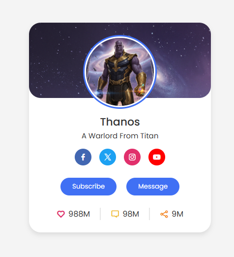

# Profile Card Project

This is a simple **Profile Card** built using **HTML** and **CSS**. The card displays basic user information like profile picture, name, role, and social links in a clean, responsive design.

## Features
- Responsive design
- Hover effects for buttons or social icons
- Easy to customize
- Clean and modern UI

## Screenshots
 <!-- Replace with your screenshot file -->

## How to Use
1. Clone the repository:
   ```bash
git clone https://github.com/Niloynh/html-css-mini-projects.git
